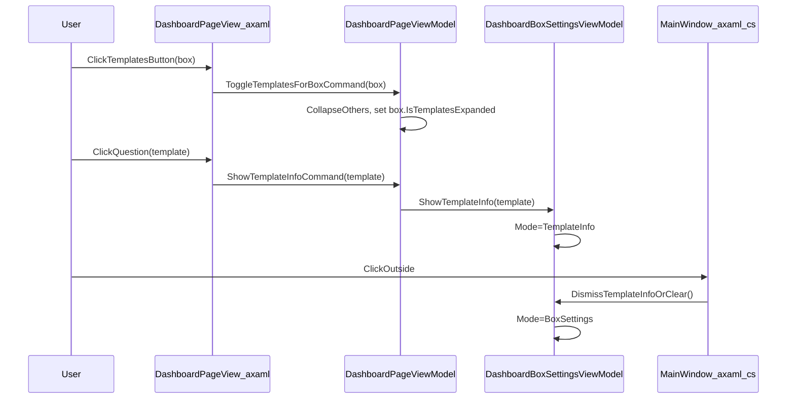

# Task1_DashboardTemplatePicker_Plan

## Goals

- Add a **new button on each box card** in the Dashboard list that **expands that card downward** to show **template options** (placeholder templates).
- Each template option shows **TemplateName**, a **Select** button, and a **?** button.
- Clicking **?** shows **template information in the right sidebar where Box Settings currently renders**, temporarily replacing Box Settings.
- **Click-out** (existing behavior) should **dismiss Template Info back to Box Settings** (your chosen behavior), not clear the sidebar.
- Leave room for Task 2 by creating a simple **data flow + persistence field** for the selected template (placeholder) per box.

## Existing code we’ll extend

- Dashboard list UI lives in [`Boxes.App/Views/DashboardPageView.axaml`](Boxes.App/Views/DashboardPageView.axaml) (the `ListBox` at `Boxes` and its item `DataTemplate`).
- Right sidebar content on Dashboard is the `DashboardBoxSettingsView` hosted by `MainWindow`:
  - [`Boxes.App/ViewModels/MainWindowViewModel.cs`](Boxes.App/ViewModels/MainWindowViewModel.cs) sets `SidebarContent` to `_dashboardSidebar` when on Dashboard.
  - Click-out logic is centralized in [`Boxes.App/Views/MainWindow.axaml.cs`](Boxes.App/Views/MainWindow.axaml.cs).
- Box settings sidebar UI/VM:
  - [`Boxes.App/Views/DashboardBoxSettingsView.axaml`](Boxes.App/Views/DashboardBoxSettingsView.axaml)
  - [`Boxes.App/ViewModels/DashboardBoxSettingsViewModel.cs`](Boxes.App/ViewModels/DashboardBoxSettingsViewModel.cs)

## UI/UX changes (Dashboard list)

- **File**: [`Boxes.App/Views/DashboardPageView.axaml`](Boxes.App/Views/DashboardPageView.axaml)
- Convert each box card to an **expandable container** (recommend `Expander`) so it expands *downward inside the list*.
  - **Header**: keep the existing card UI (Name/Description/Badges/Actions).
  - Add a new action button in the right-side action row:
    - **Button text**: `Templates` (placeholder)
    - **Command**: `ToggleTemplatesForBoxCommand`
    - **CommandParameter**: the box item (`BoxSummaryViewModel`)
- **Expanded content** (inside the expander):
  - Title row: `Templates` + optional subtitle (`Pick a layout preset for this box`).
  - An `ItemsControl` listing placeholder templates from the page VM.
  - Each template row contains:
    - `TextBlock` template name
    - `Button` “Select”
    - `Button` “?”

## ViewModel changes (Dashboard page)

- **File**: [`Boxes.App/ViewModels/DashboardPageViewModel.cs`](Boxes.App/ViewModels/DashboardPageViewModel.cs)
- Add placeholder template catalog:
  - `ObservableCollection<BoxTemplateOptionViewModel> AvailableTemplates`
  - Populate with placeholders (e.g., `Minimal`, `CompactGrid`, `HeaderPlusBadges`, etc.)
- Add commands:
  - `IRelayCommand<BoxSummaryViewModel?> ToggleTemplatesForBoxCommand`
    - Enforce your chosen behavior: **only one expanded at a time**
    - Also set `SelectedBox = box` when toggling open (so template actions can operate on the selected box without needing multi-parameter plumbing in XAML)
  - `IAsyncRelayCommand<BoxTemplateOptionViewModel?> SelectTemplateForSelectedBoxCommand`
    - Persists placeholder `TemplateKey` onto the selected box (see “Data flow & persistence”)
  - `IRelayCommand<BoxTemplateOptionViewModel?> ShowTemplateInfoCommand`
    - Calls into `BoxSettingsHost` to show template info (without losing the currently loaded box)

## ViewModel changes (Box item)

- **File**: [`Boxes.App/ViewModels/BoxSummaryViewModel.cs`](Boxes.App/ViewModels/BoxSummaryViewModel.cs)
- Add UI-only state:
  - `bool IsTemplatesExpanded` (binds to `Expander.IsExpanded`)
- Add Task-2 prep field (persisted):
  - `string? TemplateKey` (or `TemplateId`) mirrored to/from `DesktopBox`

## Sidebar changes (Template Info replaces Box Settings)

- **Files**:
  - [`Boxes.App/ViewModels/DashboardBoxSettingsViewModel.cs`](Boxes.App/ViewModels/DashboardBoxSettingsViewModel.cs)
  - [`Boxes.App/Views/DashboardBoxSettingsView.axaml`](Boxes.App/Views/DashboardBoxSettingsView.axaml)
- Add a simple “mode” to the sidebar VM:
  - `enum DashboardSidebarMode { Empty, BoxSettings, TemplateInfo }`
  - Properties:
    - `DashboardSidebarMode Mode`
    - `BoxTemplateOptionViewModel? CurrentTemplateInfo`
- Add methods/commands:
  - `ShowTemplateInfo(BoxTemplateOptionViewModel template)`
    - Sets `Mode = TemplateInfo` and stores the selected template.
    - Does **not** clear `CurrentBox`; it should remain loaded so we can return.
  - `DismissTemplateInfoOrClear()`
    - If `Mode == TemplateInfo`: set `Mode = (CurrentBox != null ? BoxSettings : Empty)`
    - Else: behave like today’s `Clear()`
- Update `DashboardBoxSettingsView.axaml` to render:
  - Existing “Empty State” when `Mode == Empty`
  - Existing “Populated State” when `Mode == BoxSettings`
  - New **Template Info** card when `Mode == TemplateInfo` (placeholder content)

## Click-out behavior (keep existing UX, but smarter)

- **File**: [`Boxes.App/Views/MainWindow.axaml.cs`](Boxes.App/Views/MainWindow.axaml.cs)
- Replace the current behavior:
  - From: clear only when `HasCurrentBox`
  - To: call `dashboardSidebar.DismissTemplateInfoOrClear()` when the sidebar is the dashboard sidebar.
- This keeps the same click-out “dismiss” pattern, but matches your desired behavior:
  - **TemplateInfo → BoxSettings**
  - **BoxSettings → Empty**

## Data flow & persistence (Task 2 groundwork)

- **Files**:
  - [`Boxes.App/Models/DesktopBox.cs`](Boxes.App/Models/DesktopBox.cs)
  - [`Boxes.App/Services/BoxService.cs`](Boxes.App/Services/BoxService.cs)
  - [`Boxes.App/ViewModels/BoxSummaryViewModel.cs`](Boxes.App/ViewModels/BoxSummaryViewModel.cs)
- Add a persisted field to `DesktopBox`, e.g.:
  - `public string? TemplateKey { get; set; }`
- Update `BoxService.AddOrUpdateAsync(...)` + `Clone(...)` to read/write this field.
- Wire it through `BoxSummaryViewModel.FromModel(...)`, `UpdateFromModel(...)`, and `ToModel()`.
- In `SelectTemplateForSelectedBoxCommand`, set `SelectedBox.TemplateKey = template.Key` and call existing save/update pipeline (same as name/description changes do today).

## Interaction diagram

## Implementation todos

- **ui-expand**: Update [`Boxes.App/Views/DashboardPageView.axaml`](Boxes.App/Views/DashboardPageView.axaml) to add the Templates button and per-row expander content.
- **vm-templates**: Add `AvailableTemplates` + commands in [`Boxes.App/ViewModels/DashboardPageViewModel.cs`](Boxes.App/ViewModels/DashboardPageViewModel.cs).
- **vm-boxstate**: Add `IsTemplatesExpanded` and `TemplateKey` plumbing in [`Boxes.App/ViewModels/BoxSummaryViewModel.cs`](Boxes.App/ViewModels/BoxSummaryViewModel.cs).
- **sidebar-templateinfo**: Add `Mode` + template info UI state in [`Boxes.App/ViewModels/DashboardBoxSettingsViewModel.cs`](Boxes.App/ViewModels/DashboardBoxSettingsViewModel.cs) and render it in [`Boxes.App/Views/DashboardBoxSettingsView.axaml`](Boxes.App/Views/DashboardBoxSettingsView.axaml).
- **clickout**: Update click-out to call `DismissTemplateInfoOrClear()` in [`Boxes.App/Views/MainWindow.axaml.cs`](Boxes.App/Views/MainWindow.axaml.cs).
- **persist-templatekey**: Add `TemplateKey` to [`Boxes.App/Models/DesktopBox.cs`](Boxes.App/Models/DesktopBox.cs) and persist it in [`Boxes.App/Services/BoxService.cs`](Boxes.App/Services/BoxService.cs).